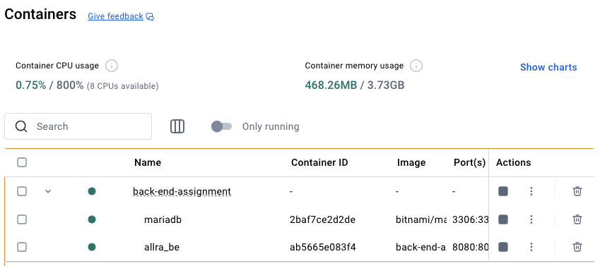
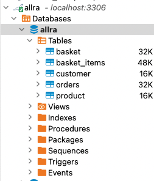
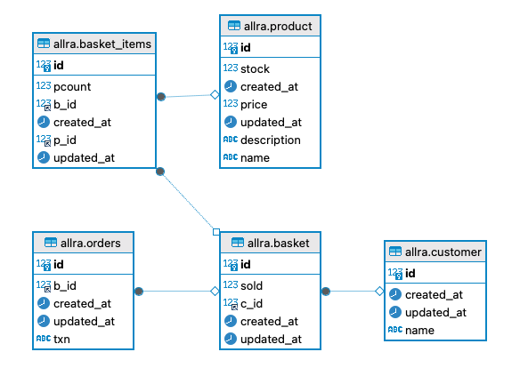
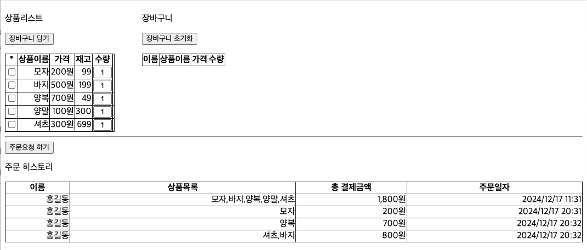
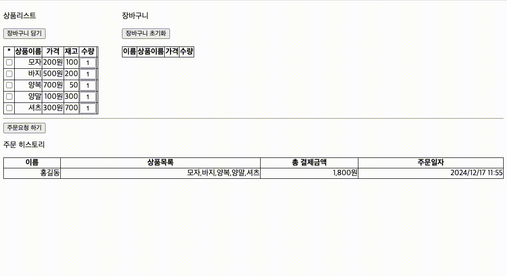

# 📣 올라 백엔드 과제 제출 [이용희]

## 개발환경
- OS : Mac
- IDE : STS
- 구조 : Spring Boot + Tomcat10 + JPA + thymeleaf
- Infra : Docker
    
- 실행방법 : <br>
    ```bash
    $ sh run.sh
    ```
- Dummy 파일 : 아래 파일에 기본적인 정보는 더미로 저장되어 실행시 불러오도록 조치    
    ```
    $ cat src/main/resources/data.sql
    ```
- DB 구조<br>
    
    
- 접속방법<br>
    http://localhost:8080/
    
- 사용방법<br>
    
--------

# ✏️ 과제 개요

1. 상품 조회 : 구매 가능한 상품 목록을 불러옵니다.
2. 장바구니 : 상품을 장바구니에 추가하고 수량을 관리합니다.
3. 주문 및 결제 : 주문을 제출하고 결제를 처리합니다.
4. 주문 내역 조회 : 사용자의 완료된 주문 기록을 조회합니다.

# 📝 요구 사항

## 1️⃣ 기술적 요구사항
- Java 17 이상
- SpringBoot 버전 3.x 이상
- Database는 MariaDB 10.x
- Database 상호작용에는 JPA를 사용
- Git을 사용해 작업 내용을 관리
- README.md를 작성

## 2️⃣ 기능적 요구사항

### ✅ 상품 조회
상품 목록을 불러오는 API를 구현해주세요.  
### ✅ 장바구니
사용자별 장바구니에 상품을 추가, 수정, 삭제할 수 있는 기능을 구현해주세요.  
### ✅ 주문 및 결제
주문을 처리하는 API를 구현해주세요.  
```
[주문 및 결제 상세 요구사항]
- 주문 요청 시 장바구니에 담긴 모든 상품들의 금액을 합산하여 결제를 진행해야 합니다.
- 주문 요청 시 상품의 재고를 관리해야합니다.
- 결제 요청은 외부 결제 API를 사용하여 처리해야 합니다.
- 결제 요청 이력을 관리할 수 있어야 합니다.
- 결제 성공 및 실패 여부에 따라 적절한 응답을 반환해야 합니다.
```